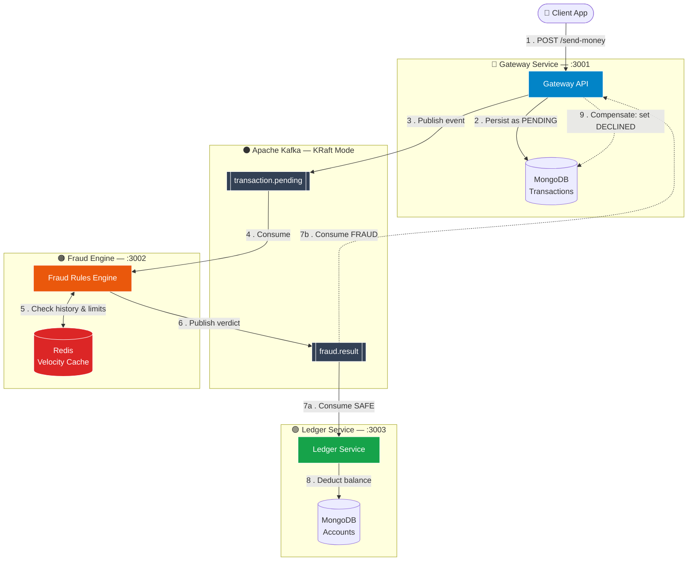

<div align="center">

# 🏦 banking-system

### Distributed Digital Banking Fraud Detection System

*An event-driven microservices platform for real-time fraud detection, built on the SAGA pattern for distributed transaction consistency.*

[](https://nodejs.org/)
[](https://kafka.apache.org/)
[](https://redis.io/)
[](https://www.mongodb.com/)
[](https://www.docker.com/)
[](./LICENSE)

</div>

---

## 📖 Overview

**banking-system** is a distributed, event-driven digital payments platform built as a B.Tech Project (BTP). It simulates a real-world banking backend where every money transfer is independently validated for fraud **before** funds are moved — without ever blocking the client on a slow, synchronous fraud check.

The system is composed of independently deployable microservices that communicate exclusively through **Apache Kafka**, coordinated via the **SAGA pattern** to guarantee eventual consistency across services that each own their own database (Database-per-Service).

> **Core idea:** A transaction is never processed in one big atomic step. It moves through a chain of local transactions — each publishing an event that triggers the next service, with compensating actions (rollbacks) defined for every step that can fail.

### ✨ Highlights

| Capability | Description |
|---|---|
| 🔀 **Event-driven microservices** | Services never call each other directly — all communication happens over Kafka topics |
| 🧾 **SAGA orchestration (choreography-based)** | Each service reacts to events and emits its own, forming a decentralized transaction chain |
| ⚡ **Real-time velocity checks** | Redis-backed sliding-window checks catch rapid-fire fraud patterns in milliseconds |
| 🗄️ **Database-per-service** | Each service owns its own MongoDB collection — no shared database, no tight coupling |
| ↩️ **Automatic compensating rollbacks** | A declined transaction automatically unwinds itself back to a safe state |
| 🐳 **Fully containerized** | One `docker-compose up` boots the entire distributed system locally |

---

## 🧱 Architecture & Tech Stack

| Layer | Technology | Purpose |
|---|---|---|
| **Runtime** | Node.js (Express.js) | Lightweight, non-blocking service runtime for all microservices |
| **Message Broker** | Apache Kafka (KRaft mode) | Async, durable, ordered event streaming — no Zookeeper dependency |
| **Cache / Rules Store** | Redis | Sub-millisecond velocity checks (transaction frequency, spending limits) |
| **Persistence** | MongoDB | Per-service document store — Transactions DB and Accounts DB are fully isolated |
| **Containerization** | Docker & Docker Compose | Reproducible local environment across all teammates' machines |
| **Coordination Pattern** | SAGA (Choreography-based) | Distributed transaction consistency without a central orchestrator |

### Why this stack?

- **Kafka (KRaft mode)** removes the Zookeeper dependency entirely, simplifying local setup for a student team while still teaching production-grade event streaming concepts.
- **Redis** gives the Fraud Engine a velocity cache that would be far too slow to run against MongoDB on every transaction.
- **MongoDB per service** enforces genuine service autonomy — a core requirement for any credible microservices architecture, and a deliberate teaching point of this BTP.

---

## 🗺️ System Architecture Diagram



**Legend:** Solid arrows (`→`) represent the happy path. Dashed arrows (`-.→`) represent the SAGA compensating (rollback) path, triggered only when the Fraud Engine declines a transaction.

---

## 🔄 Detailed SAGA Pattern & Data Flow

This system implements a **choreography-based SAGA** — there is no central orchestrator. Each service listens for events, does its local work, and emits the next event. This keeps services fully decoupled but requires every step to have a well-defined compensating action.

### Happy path (transaction approved)

| Step | Service | Action |
|---|---|---|
| 1 | Client → Gateway | Client issues `POST /send-money` with sender, receiver, and amount |
| 2 | Gateway | Persists the transaction in `TxDB` with status `PENDING` |
| 3 | Gateway → Kafka | Publishes the transaction onto the `transaction.pending` topic |
| 4 | Fraud Engine | Consumes the event from `transaction.pending` |
| 5 | Fraud Engine ↔ Redis | Runs velocity checks — transaction frequency, daily limits, geo/device anomalies — against the Redis cache |
| 6 | Fraud Engine → Kafka | Publishes a verdict (`SAFE` or `FRAUD`) onto `fraud.result` |
| 7a | Ledger Service | Consumes `SAFE` verdicts from `fraud.result` |
| 8 | Ledger Service | Deducts the sender's balance in `AccDB` and marks the transaction `COMPLETED` |

### Rollback path (transaction declined)

| Step | Service | Action |
|---|---|---|
| 7b | Gateway | Consumes `FRAUD` verdicts from `fraud.result` instead of the Ledger Service |
| 9 | Gateway | Executes the **compensating transaction**: updates `TxDB`, flipping the record from `PENDING` → `DECLINED` |

Because no funds are ever deducted until Step 8, the compensating action in Step 9 is purely a **status correction** — there is no need to "refund" money that was never moved. This is a deliberate design choice that keeps the SAGA simple: the Ledger Service is the single source of truth for balance mutations, and it only acts *after* fraud clearance.

### Why SAGA instead of a distributed 2PC transaction?

- Each service owns its own database — a classic two-phase commit would require a shared transaction coordinator and tightly couple all three services.
- Kafka provides durable, replayable event logs, so a service that's temporarily down can catch up without losing events.
- Failure isolation: if the Ledger Service goes down, pending transactions simply queue in Kafka rather than blocking the Gateway or Fraud Engine.

---

## 👥 Team Work Breakdown

| # | Member | Module Owned | Core Responsibilities |
|---|---|---|---|
| **1** | **Gateway** | `gateway-service` (:3001) | REST API design, request validation, `TxDB` schema, Kafka producer for `transaction.pending`, SAGA rollback consumer for `fraud.result` (FRAUD branch) |
| **2** | **Fraud Rules** | `fraud-engine` (:3002) | Kafka consumer for `transaction.pending`, fraud rule design (limits, blacklists, anomaly heuristics), verdict publishing to `fraud.result` |
| **3** | **Redis Velocity** | Velocity cache layer | Redis schema design (sliding-window counters, TTL strategy), integration with Fraud Engine, load/latency benchmarking |
| **4** | **Ledger / Rollbacks** | `ledger-service` (:3003) | `AccDB` schema, balance-deduction logic, Kafka consumer for `fraud.result` (SAFE branch), idempotency guarantees, compensating-transaction design review |

> 💡 **Integration checkpoints:** All four members' services communicate *only* through Kafka topics and REST contracts defined in [`/docs/api-contracts.md`](./docs/api-contracts.md). No service should ever import another service's code or query another service's database directly.

---

## 🚀 Getting Started / Local Development Guide

### Prerequisites

- [Docker](https://www.docker.com/) & Docker Compose (v2+)
- [Node.js](https://nodejs.org/) 18.x or later
- [Git](https://git-scm.com/)

### 1. Clone the repository

```bash
git clone https://github.com/<your-org>/banking-system.git
cd banking-system
```

### 2. Configure environment variables

Copy the example env file for each service and adjust as needed:

```bash
cp gateway-service/.env.example gateway-service/.env
cp fraud-engine/.env.example fraud-engine/.env
cp ledger-service/.env.example ledger-service/.env
```

### 3. Launch infrastructure with Docker Compose

This spins up Kafka (KRaft mode), Redis, and MongoDB in one command:

```bash
docker-compose up -d
```

Verify all containers are healthy:

```bash
docker-compose ps
```

### 4. Install dependencies for each service

```bash
cd gateway-service && npm install && cd ..
cd fraud-engine && npm install && cd ..
cd ledger-service && npm install && cd ..
```

### 5. Run each microservice

Open a separate terminal per service:

```bash
# Terminal 1 — Gateway API
cd gateway-service && npm run dev

# Terminal 2 — Fraud Engine
cd fraud-engine && npm run dev

# Terminal 3 — Ledger Service
cd ledger-service && npm run dev
```

### 6. Send a test transaction

```bash
curl -X POST http://localhost:3001/send-money \
  -H "Content-Type: application/json" \
  -d '{
    "senderId": "acc_101",
    "receiverId": "acc_202",
    "amount": 500
  }'
```

Watch the terminals — you should see the event flow live across Gateway → Kafka → Fraud Engine → Kafka → Ledger.

### 7. Tear down

```bash
docker-compose down -v
```

---

## 🔮 Future Scope

- **🤖 Machine Learning fraud-scoring layer** *(planned for next semester)* — replacing/augmenting the current rule-based Fraud Engine with a trained anomaly-detection model (e.g. Isolation Forest or a lightweight neural classifier) served via a dedicated `ml-inference` microservice, consuming the same `transaction.pending` topic.
- **📊 Real-time monitoring dashboard** — Grafana + Prometheus for Kafka consumer lag, fraud-decision latency, and rollback rates.
- **🔐 JWT-based authentication & rate limiting** on the Gateway API.
- **🧪 Chaos-testing the SAGA** — deliberately killing services mid-flow to validate rollback correctness under failure.
- **☸️ Kubernetes deployment manifests** to replace Docker Compose for a production-style deployment demo.

---

<div align="center">

**Built as a B.Tech Capstone Project (BTP)** · Event-driven microservices · SAGA pattern · Kafka · Redis · MongoDB

</div>
